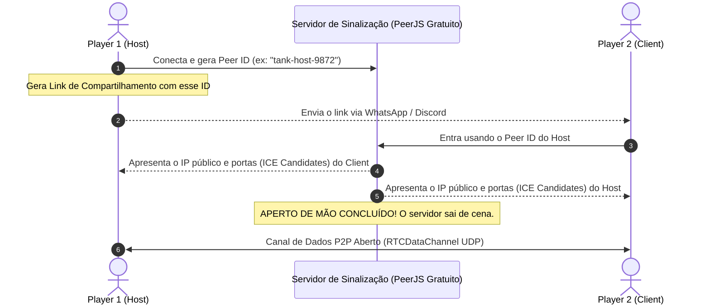

# Guia Definitivo: Criando Jogos Multiplayer Online P2P Sem Servidor (WebRTC)

> Um guia prático, arquitetural e completo para entender como conectar dois navegadores diretamente com zero custo de servidor e criar novos jogos online síncronos e fluidos mesmo em redes de alta latência (~150ms).

---

## 📑 Índice
1. [Visão Geral e Por Que WebRTC P2P?](#1-visão-geral-e-por-que-webrtc-p2p)
2. [Arquitetura de Conexão Sem Servidor Dedicado](#2-arquitetura-de-conexão-sem-servidor-dedicado)
3. [Topologia: Host-Autoritativo vs Peer-to-Peer Puro](#3-topologia-host-autoritativo-vs-peer-to-peer-puro)
4. [O Netcode Moderno: Como Vencer 150ms de Latência](#4-o-netcode-moderno-como-vencer-150ms-de-latência)
   - [A. Predição do Cliente (0ms de Delay Local)](#a-predição-do-cliente-0ms-de-delay-local)
   - [B. Sequenciamento de Inputs (`seq` e `ackSeq`)](#b-sequenciamento-de-inputs-seq-e-ackseq)
   - [C. Reconciliação do Host e Amortecimento de Erro (*Error Decay*)](#c-reconciliação-do-host-e-amortecimento-de-erro-error-decay)
   - [D. Compensação de Lag em Projéteis e Tiros (*Lag Compensation*)](#d-compensação-de-lag-em-projéteis-e-tiros-lag-compensation)
   - [E. Interpolação Suave a 60 FPS (LERP)](#e-interpolação-suave-a-60-fps-lerp)
5. [Contrato de Rede: Tipos de Pacotes Essenciais](#5-contrato-de-rede-tipos-de-pacotes-essenciais)
6. [Passo a Passo: Como Construir um Novo Jogo do Zero](#6-passo-a-passo-como-construir-um-novo-jogo-do-zero)
7. [Template Mínimo de Código Reutilizável (Boilerplate)](#7-template-mínimo-de-código-reutilizável-boilerplate)
8. [Dicas de Ouro e Armadilhas Comuns](#8-dicas-de-ouro-e-armadilhas-comuns)

---

## 1. Visão Geral e Por Que WebRTC P2P?

Tradicionalmente, a indústria de jogos online utiliza **servidores dedicados centralizados** (VPS, AWS, etc.):
```text
[Jogador 1] ─── (Internet) ───▶ [Servidor em SP / EUA] ─── (Internet) ───▶ [Jogador 2]
```
- **Problemas do modelo tradicional:** Custo mensal contínuo de hospedagem, manutenção de infraestrutura, e a latência dobra porque os dados sempre precisam passar pelo servidor antes de chegar ao outro jogador.

Com o **WebRTC DataChannels**, o navegador moderno pode se conectar diretamente com outro navegador:
```text
[Jogador 1 (Host)] ◀═════════ (Cabo Direto WebRTC UDP) ═════════▶ [Jogador 2 (Client)]
```
- **Vantagens:**
  - **Custo Zero:** Não há servidor de processamento de jogo para alugar.
  - **Menor Latência Possível:** Os pacotes viajam pela rota física mais curta entre os dois provedores de internet.
  - **Privacidade e Simplicidade:** Toda a lógica roda inteiramente no cliente.

---

## 2. Arquitetura de Conexão Sem Servidor Dedicado

Se não há servidor dedicado de jogo, como dois computadores em casas diferentes conseguem se encontrar?

Eles usam um processo chamado **Sinalização (Handshake)**, que dura apenas 1 a 2 segundos:



1. **Servidor STUN / Sinalização (PeerJS público gratuito):** Serve exclusivamente como um "catálogo telefônico". Ele apenas troca os endereços de rede dos dois jogadores.
2. **Desconexão do intermediário:** Uma vez que o canal `RTCDataChannel` é aberto, **100% dos pacotes do jogo (teclas, posições, tiros, mortes) viajam ponto a ponto**, sem nunca mais passar por nenhum servidor da nuvem.

---

## 3. Topologia: Host-Autoritativo vs Peer-to-Peer Puro

Em jogos multiplayer, existem duas maneiras de desenhar a lógica:

| Característica | P2P Puro (Descentralizado) | Host-Autoritativo (Usado no Tank 1990) |
| :--- | :--- | :--- |
| **Quem calcula as regras?** | Ambos tentam calcular tudo simultaneamente | **Apenas o Player 1 (Host)** |
| **Risco de Dessincronia** | **Altíssimo:** se um pacote atrasar, um jogador vê o tijolo quebrado e o outro não | **Zero:** a palavra do Host é a verdade absoluta do jogo |
| **Inteligência Artificial (IA)** | Difícil sincronizar sementes aleatórias | Simples: a IA roda no Host e a posição é enviada ao Client |
| **Complexidade de Código** | Extrema | Moderada e altamente robusta |

### A Regra de Ouro do Host-Autoritativo:
- **Host (Player 1):** Roda o motor de física, colisão de projéteis, inteligência dos inimigos, spawning de itens e contagem de vidas.
- **Client (Player 2):** Captura as teclas locais, move o próprio tanque visualmente de forma instantânea, e recebe periodicamente a "foto oficial" do mundo calculada pelo Host.

---

## 4. O Netcode Moderno: Como Vencer 150ms de Latência

Se o Player 2 mora longe ou usa Wi-Fi instável com 150ms de ping, enviar uma tecla e esperar o Host responder causaria uma sensação horrível de "tanque pesado" e atraso de disparo.

Para resolver isso, combinamos **5 técnicas da indústria de jogos competitivos**:

### A. Predição do Cliente (0ms de Delay Local)
Quando o Player 2 pressiona uma tecla de movimento (`W`, `A`, `S`, `D`):
- O navegador dele **não espera** a autorização do Host.
- O tanque do Player 2 se move **no milissegundo zero** na tela dele.
- Sensação: resposta tátil instantânea idêntica a um jogo offline.

### B. Sequenciamento de Inputs (`seq` e `ackSeq`)
Como o Player 2 está se movendo no futuro em relação ao Host, precisamos registrar o histórico desse movimento:
1. Cada toque no teclado gera um pacote com número sequencial:
   ```javascript
   { type: 'INPUT', seq: 42, input: { up: true, fire: false } }
   ```
2. O Client guarda esse comando num array local chamado `inputHistory`.
3. O Host recebe o comando 42, move o Player 2 no mundo autoritativo e anota: `lastProcessedSeq = 42`.
4. No próximo snapshot enviado pelo Host, ele avisa:
   ```javascript
   { type: 'SYNC', ackSeq: 42, p2: { x: 120, y: 180 } }
   ```

### C. Reconciliação do Host e Amortecimento de Erro (*Error Decay*)
Quando o Client recebe a confirmação `ackSeq: 42`:
1. Ele joga fora do histórico todos os comandos com número $\le 42$ (pois o Host já os executou).
2. Ele pega a posição oficial enviada pelo Host e aplica por cima dela os comandos pendentes (ex: 43, 44, 45) que ainda não foram processados pelo Host.
3. **Se houver divergência (ex: colisão não prevista com uma parede):**
   - **Forma antiga e ruim (Rubberbanding):** Teletransportar o tanque instantaneamente para trás.
   - **Nossa solução (*Error Decay*):** Armazenamos a diferença no vetor `visualErrorX/Y` e amortecemos exponencialmente a cada frame:
     ```javascript
     visualErrorX *= 0.85; // Dissipa o erro suavemente em poucos milissegundos
     ```
   - Resultado: O jogador é corrigido sem nenhum tranco ou sobressalto perceptível aos olhos.

### D. Compensação de Lag em Projéteis e Tiros (*Lag Compensation*)
Quando o Player 2 atira com 150ms de ping, o comando demora metade do ping (~75ms) para chegar ao Host.
Se o Host criasse o tiro exatamente no momento em que a mensagem chega:
- O projétil no Host estaria atrasado em relação ao que o Player 2 viu na própria tela.
- **Solução no Host:** Ao receber o comando de disparo vindo do cliente, o Host calcula a distância percorrida no tempo de trânsito da rede e **projeta o tiro para frente no espaço**:
  $$\text{Deslocamento} = \left(\frac{\text{Ping}}{2 \times 1000}\right) \times \text{Velocidade do Projétil} \times 60$$
- Desta forma, o tiro voa sincronizado na mesma coordenada física tanto na tela do Host quanto na do Client!

### E. Interpolação Suave a 60 FPS (LERP)
Para tanques inimigos e o Player 1 exibidos na tela do Client:
Em vez de desenhar onde o pacote de rede mais recente disse que eles estão (o que causaria "teletransportes a cada 50ms"), o jogo faz uma interpolação linear exponencial no frame renderizado:
```javascript
p1.x += (targetX - p1.x) * 0.35;
p1.y += (targetY - p1.y) * 0.35;
```
Isso garante uma movimentação aveludada a 60 quadros por segundo constantes.

---

## 5. Contrato de Rede: Tipos de Pacotes Essenciais

Um jogo multiplayer limpo precisa de um conjunto bem definido de mensagens trocadas no canal de dados:

| Tipo de Pacote | Origem | Frequência | Conteúdo Principal |
| :--- | :--- | :--- | :--- |
| `INIT` | Host ➔ Client | No início da partida | Número da fase, mapa de blocos inicial, posições de spawn. |
| `INPUT` | Client ➔ Host | Ao mudar teclas / 60Hz | `{ seq, input: { up, down, left, right, fire } }` |
| `SYNC` | Host ➔ Client | 20Hz a 60Hz contínuos | `{ ackSeq, ping, p1, p2, enemies, remainingEnemies, lives, scores }` |
| `EVENT` | Host ➔ Client | Sob demanda | Eventos visuais imediatos: explosões, coleta de powerups, alertas. |
| `PING` / `PONG` | Ambos | A cada 1 segundo | Medição precisa de latência em milissegundos para os cálculos de lag. |
| `REQUEST_RESTART` | Client ➔ Host | No menu Game Over | Solicita reiniciar a partida na mesma fase ou na fase seguinte. |
| `RESTART` | Host ➔ Client | Quando reinicia | Notifica o reinício imediato, novo mapa e reset de vidas e scores. |

---

## 6. Passo a Passo: Como Construir um Novo Jogo do Zero

Para criar um novo jogo (ex: nave espacial, corrida, plataforma, luta) usando essa exata mesma tecnologia, siga este roteiro:

### Passo 1: Defina o Escopo e a Separação de Arquivos
Estruture seu projeto de forma limpa:
```text
meu-jogo/
├── index.html            # Canvas + import dos scripts
├── css/style.css         # Estilização de tela cheia e fontes
└── js/
    ├── main.js           # Ponto de entrada, inicialização do canvas
    ├── game.js           # Loop principal (update, render, estados)
    ├── entities.js       # Classes dos jogadores, inimigos, projéteis
    ├── input.js          # Escuta de Teclado, Mouse e Gamepad
    ├── audio.js          # Web Audio API sintetizada (sons sem carregar .mp3)
    └── multiplayer.js    # Gerenciador WebRTC (PeerJS + Netcode)
```

### Passo 2: Inicialize o Canvas com Resolução Fixa e Escalada
Para garantir que o jogo fique idêntico em telas de celular, monitores ultrawide ou laptops:
- Use uma **resolução virtual interna fixa** (ex: 256x224 do NES, ou 1280x720 moderno).
- Ajuste o CSS para esticar com proporção preservada (`object-fit: contain`).

### Passo 3: Implemente o Loop com Delta Time (`dt`)
Nunca vincule a velocidade do jogo à taxa de atualização do monitor do usuário (alguns usam 60Hz, outros 144Hz, 240Hz):
```javascript
function gameLoop(timestamp) {
  const dt = Math.min((timestamp - lastTime) / 1000, 0.1); // Trava máxima para evitar saltos gigantes
  lastTime = timestamp;

  update(dt);
  render();

  requestAnimationFrame(gameLoop);
}
```

### Passo 4: Conecte o Netcode (Host vs Client)
- Adicione a biblioteca PeerJS via CDN:
  ```html
  <script src="https://unpkg.com/peerjs@1.5.2/dist/peerjs.min.js"></script>
  ```
- Ao criar a sala, o Host gera uma URL com hash: `meujogo.com/#hostId`.
- Quando o Client abre a URL com esse hash, o jogo entra automaticamente no modo `CLIENT` e conecta ao Host.

### Passo 5: Aplique o Netcode de Ação (Predição + Snapshot)
- Mova o jogador local de imediato.
- O Host manda o snapshot do estado a 60 FPS (ou 30 FPS se quiser economizar banda).
- O Client reconcilia a posição e interpola as outras entidades.

---

## 7. Template Mínimo de Código Reutilizável (Boilerplate)

Abaixo está a base pronta e limpa para gerenciar conexões P2P com PeerJS e envio de pacotes:

```javascript
// js/network.js - Template Mínimo P2P
class SimpleNetworkManager {
  constructor(onConnected, onMessageReceived) {
    this.peer = null;
    this.conn = null;
    this.mode = 'OFFLINE'; // 'HOST' | 'CLIENT' | 'OFFLINE'
    this.isConnected = false;
    this.onConnected = onConnected;
    this.onMessageReceived = onMessageReceived;
    this.ping = 0;
  }

  initHost() {
    this.mode = 'HOST';
    this.peer = new Peer();

    this.peer.on('open', (id) => {
      console.log('Sala criada! Compartilhe o link com ID:', id);
      // Cria link copiável: window.location.origin + window.location.pathname + '#' + id
    });

    this.peer.on('connection', (connection) => {
      this.conn = connection;
      this._setupConnection();
    });
  }

  joinRoom(hostId) {
    this.mode = 'CLIENT';
    this.peer = new Peer();

    this.peer.on('open', () => {
      this.conn = this.peer.connect(hostId, { reliable: false }); // UDP não confiável para baixa latência
      this._setupConnection();
    });
  }

  _setupConnection() {
    this.conn.on('open', () => {
      this.isConnected = true;
      console.log('Conexão P2P direta estabelecida com sucesso!');
      if (this.onConnected) this.onConnected(this.mode);
    });

    this.conn.on('data', (data) => {
      // Cálculo automático de Ping
      if (data.type === 'PING') {
        this.conn.send({ type: 'PONG', sentAt: data.sentAt });
        return;
      }
      if (data.type === 'PONG') {
        this.ping = Math.round(performance.now() - data.sentAt);
        return;
      }

      if (this.onMessageReceived) {
        this.onMessageReceived(data);
      }
    });

    this.conn.on('close', () => {
      this.isConnected = false;
      console.log('Jogador desconectou.');
    });
  }

  send(data) {
    if (this.conn && this.conn.open) {
      this.conn.send(data);
    }
  }

  measurePing() {
    if (this.isConnected) {
      this.send({ type: 'PING', sentAt: performance.now() });
    }
  }
}
```

---

## 8. Dicas de Ouro e Armadilhas Comuns

1. **UDP Não Confiável para Posição (`reliable: false`):**
   - Ao sincronizar posições a 60 FPS, prefira pacotes sem confirmação de entrega do TCP. Se um pacote de posição for perdido na rede, não tente reenviá-lo! O próximo pacote que chegará 16ms depois já terá a posição mais atualizada.
2. **Determinismo em Aleatoriedade (`Math.random()`):**
   - Nunca use `Math.random()` diretamente em um Client para decidir coisas do jogo (onde o item cai, para onde o inimigo vira). Sempre deixe o **Host sortear** e mandar o resultado no pacote, garantindo que ambos vejam a mesma coisa.
3. **Web Audio API e a Política de Autoplay dos Navegadores:**
   - O Google Chrome e navegadores modernos bloqueiam o som do jogo até que o usuário interaja com a página (clique em um botão ou aperte uma tecla). Sempre inicialize o `AudioContext` após o primeiro clique ou tecla pressionada.
4. **Como Testar Sozinho no Seu Próprio Computador:**
   - Abra o jogo em uma aba normal do navegador (clique em *Criar Sala / 2 Players Online*).
   - Copie o link da sala.
   - Abra uma **janela anônima** e cole o link.
   - Coloque as duas abas lado a lado na tela. Você terá o Host e o Client interagindo em tempo real para testar colisões e disparos!
5. **Cuidado com Desfoque de Janela (`window.onblur`):**
   - Quando o jogador troca de aba (Alt+Tab), as teclas podem ficar presas como `true`. Sempre escute o evento `window.addEventListener('blur', ...)` e resete todas as teclas para `false`.

---

*Com essa estrutura, você tem em mãos a mesma tecnologia e fundamentos utilizados em motores comerciais para criar qualquer jogo multiplayer no navegador com zero servidores e máxima fidelidade sonora e visual!*
